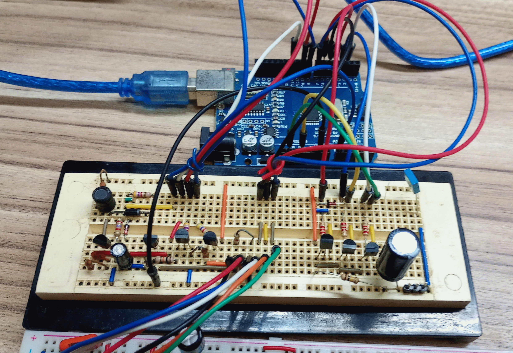
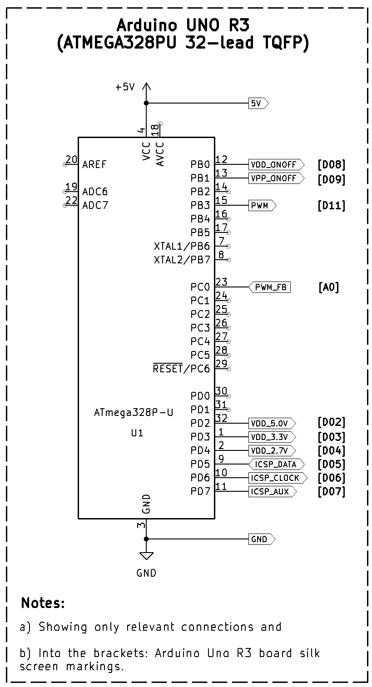
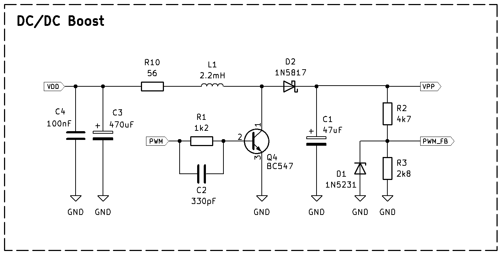
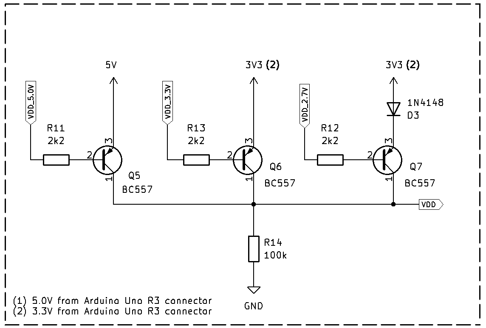
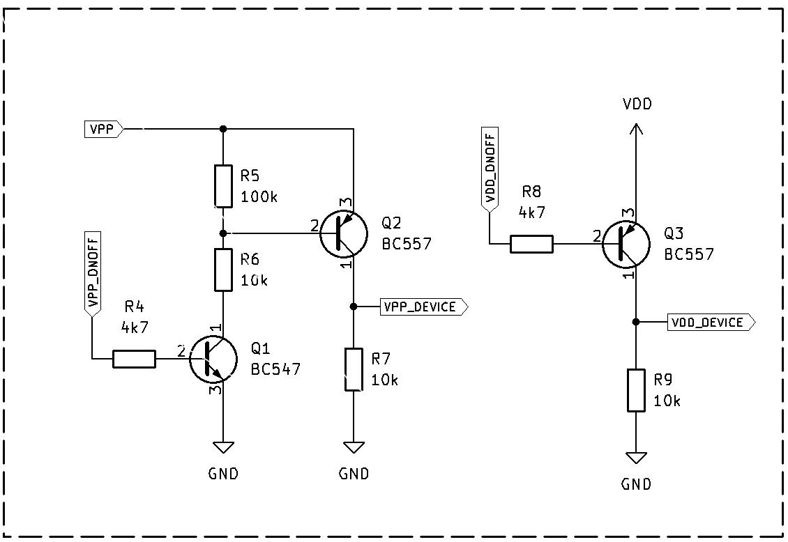
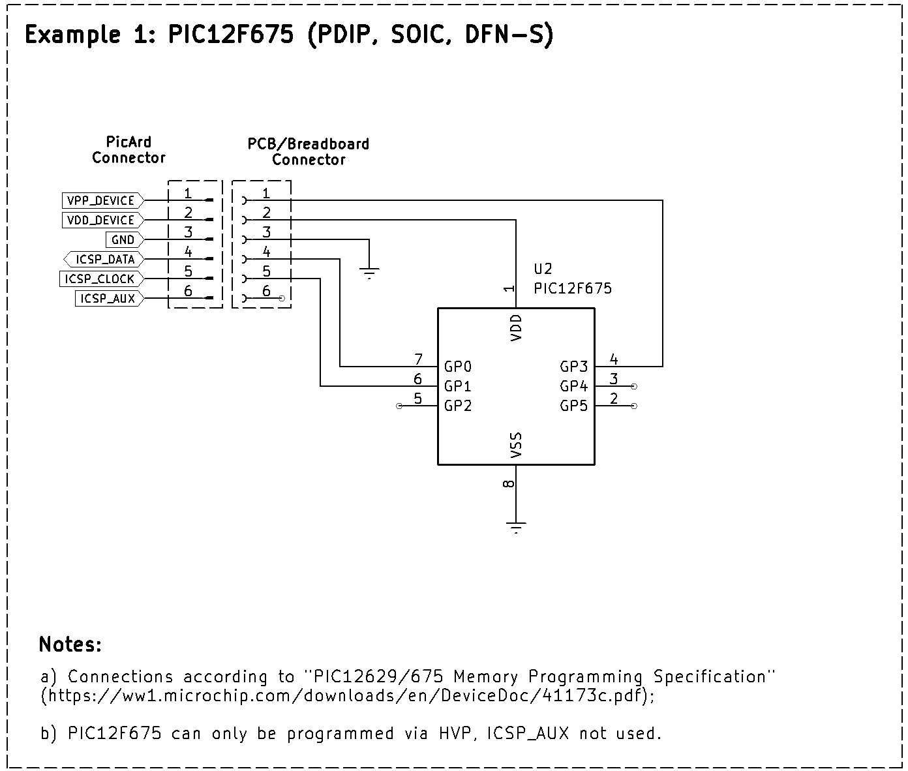
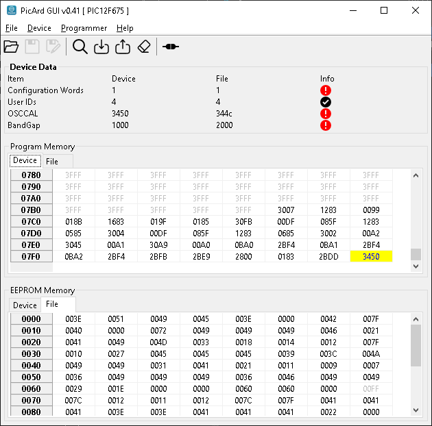

# PicArd - Ultra-Low Cost PIC Programmer

## Table of Contents

* [Intro](#a-intro)
* [Hardware](#b-picard-hardware)
* [Software](#c-picard-software)
* [Contact](#d-contact)


## A) Intro

As my projects became increasingly complex (and required more discrete components), 
I decided to migrate several of them from "discrete" electronics to microcontrollers. 

During this transition, I evaluated various microcontroller families available and 
I selected PICs because they are easy to find, cost-effective and meet my requirements.

To keep my projects as low-cost as possible (and also as a personal challenge), 
I made two decisions: a) to purchase some *PIC12F675s* (the cheapest here in Brazil) 
and some *PIC16F819s*  and  b) to build my own PIC programmer!

Thus, the PicArd (PIC + Arduino) Project  was born!

PicArd **IS**:
+ a full USB programmer for PIC microcontrollers;
+ composed by PC software, Arduino software and extremely simple and cheap hardware;
+ able to run in Windows and Linux;
+ able to use High Voltage Programming (HVP) and Low Voltage Programming (LVP);
+ script oriented (and based on [PICkit 2 Interface Guide](https://github.com/NelsonBittencourt/Picard/blob/main/docs/PICkit2_Interface_Guide.pdf) from Microchip);
+ capable of select between three voltages (5.0V, 3.3V and 2.7V) and
+ PicKit independent (you don't need to have one of them to extract firmware).

PicArd **ISN'T**:
+ a debugger for PIC microcontrollers;
+ able of performing all PicKit's functions;
+ capable of handle PIC32, EEPROM and KEELOQ families and
+ able to program device via ENHANCED ICSP (programming executive).

*Important note:* PicArd has only been tested with the PIC12F675 and PIC16F819 microcontrollers.

## B) PicArd Hardware

The PicArd hardware consists of:

1) Arduino UNO R3 (with *ATMEGA328PU* 32-lead TQFP); 
2) DC-DC step-up (boost) converter;
3) Programming voltage (VPP) control and
4) Microcontroller power supply voltage (VDD) control.

Don't be intimidated by this list! It looks very complex (except for the Arduino, perhaps),
but to assemble everything, I only used seven bipolar junction transistors (BC547s and BC557s) 
and few passive components. Check out the breadboard:

<br>
<table align="center"><tr><td> 
<br>
<p align="center" width="100%"><b>Figure 1. PicArd Breadboard</b></p>
</td></tr></table>
<br>


### B.1) Arduino Uno R3

The following figure shows Arduino Uno R3 connections to PicArd:

<br>
<table align="center"><tr><td> 
<br>
<p align="center" width="100%"><b>Figure 2. Arduino UNO R3 Connections</b></p>
</td></tr></table>
<br>

My Arduino R3 clone board has a *ATMEGA328PU* in a TQFP package. 
The pin numbers above refer to this package. If your Arduino has another package, 
consider making connections using identifications into the brackets (PCB silk screen)
or the full pin name (e.g. *PORT0*).


The connections between Arduino R3 and PicArd are:


Table 1. Labels Descriptions
| Label     |  Description | 
| :--- | :--- |
| 5V     | Positive 5V (remember, Arduino needs to be connected to PC USB) | 
| 3V3     | Positive 3.3V (from Arduino Uno) | 
| PWM  |  PWM signal for DC/DC boost converter | 
| PWM_FB  | PWM voltage feedback   | 
| VDD_ONOFF  | Turns on/off VDD to device  | 
| VPP_ONOFF | Turns on/off VPP to device  | 
| VDD_5.0V | Select/Unselect 5.0V as VDD | 
| VDD_3.3V | Select/Unselect 3.3V as VDD | 
| VDD_2.7V | Select/Unselect 2.7V as VDD | 
| ICSP_DATA  | In-circuit serial programming (ICSP) data pin | 
| ICSP_CLOCK  | ICSP clock pin  | 
| ICSP_AUX | ICSP for Low Voltage Programming (LVP)  | 
| VDD | Selected VDD |
| VDD_DEVICE | Device VDD Pin |
| VPP | Programming voltage |
| VPP_DEVICE | Device VPP Pin |
| GND     | Ground    |


### B.2) DC-DC Boost Converter

DC-DC boost converter is responsible for raising voltage from 5V to programming voltage (*VPP*)
required by PICs. This module is optional if you intend to use only PICs that support LVP.

I designed this circuit to operate with VPPs between 2V and 13V.

<br>
<table align="center"><tr><td> 
<br>
<p align="center" width="100%"><b>Figure 3. DC/DC booster</b></p>
</td></tr></table>
<br>


PWM signal from Arduino controls *Q4* through *R1* and *C2* (capacitor added to improve switching speed).
*L1*, *D2* and *C1* completes basic DC/DC boost circuitry. A voltage divider (*R2* and *R3*) is
used apply a secure voltage (<=5.0V) to PWM_FB pin. As an additional precaution, I added *D1* (5.1V zener diode).


### B.3) Voltages Control

The PICs' supply voltages (VDD) can range from 2.7V to 5.0V. Since the Arduino Uno has voltage
regulators for 3.3V and 5.0V, I used the circuit below to allow the selection of the correct 
voltage. By controlling pins D02 (VDD_5.0V), D03 (VDD_3.3V), and D04 (VDD_2.7V), we can obtain
5.0V, 3.3V, and approximately 2.7V, which covers almost all devices.

This approach eliminates the necessity of a Low Dropout Regulator (LDO), reducing the 
project cost.

<br>
<table align="center"><tr><td> 
<br>
<p align="center" width="100%"><b>Figure 4. VDD Selection Control</b></p>
</td></tr></table>
<br>

*VPP* (from DC/DC converter) and *VDD* (from above circuit) must be applied to PIC at specific times. 
Therefore, Arduino needs to send *VPP_ONOFF* and *VDD_ONOFF* signals to control when PIC will 
receive this voltages.

The circuit below shows my solution:

<br>
<table align="center"><tr><td> 
<br>
<p align="center" width="100%"><b>Figure 5. Voltages Control</b></p>
</td></tr></table>
<br>

*VPP_DEVICE* and *VDD_DEVICE* must be applied to PIC's correspondent pins. 


### B.4) Connection Examples

Connecting PicArd to PIC microcontrollers is pretty simple, just follow Microchip's 
programming specifications. 

The figures below show two connection examples:

#### B.4.1) PicArd to PIC12F675
<br>
<table align="center"><tr><td> 
<br>
<p align="center" width="100%"><b>Figure 6. PicArd connected to PIC12F675</b></p>
</td></tr></table>
<br>

Each PIC microcontroller family has its own programming specifications. 
For PIC12F675 in the example above, see: [PIC12F629/675 Memory Programming Specification](https://github.com/NelsonBittencourt/Picard/blob/main/docs/41173c.pdf)


#### B.4.2) PicArd to PIC16F819
<br>
<table align="center"><tr><td> 
<br>
<p align="center" width="100%"><b>Figure 7. PicArd connected to PIC16F819</b></p>
</td></tr></table>
<br>

This example follows [PIC16F818/819 Memory Programming Specification](https://github.com/NelsonBittencourt/Picard/blob/main/docs/39603c.pdf).


### B.5) Full Schematics

The link below contains all the schematic diagrams we have seen so far:

[Full schematic PDF](https://github.com/NelsonBittencourt/Picard/blob/main/docs/PicArd_Hardware_041.pdf)


## C) PicArd Software

PicArd requires two sets of code:

### C.1) Arduino software (firmware) main functions:

- Control and monitor PicArd's hardware voltages (voltages on/off, PWM, etc);
- Send/receive serial data to/from the connected PIC and
- Send/receive information to/from PC via USB port.

Arduino software must be uploaded to Arduino Uno R3. 
Download it [here](https://github.com/NelsonBittencourt/Picard/blob/main/software/PicArd_Arduino_Uno_Firmware_041.hex) or into *Release* section

### C.2) PC Software:

PicArd PC software has two flavors: GUI or console. Both have been compiled for Windows and Linux, and their functions are:

- Parse device database;
- Parse *'.hex'* files provided by user;
- Backup *OSCCAL*, *bandgap* and configuration words to avoid data loss and
- Send/receive information to/from Arduino via USB port.

Waring: Database file (*pic_devices.dat*) must be in the same folder that PicArd 
executable.
 
Download PicArd's PC software in *Releases* section.

### C.2.1) GUI

GUI version consists of a single main window, as shown in Figure 8.It is self-explanatory and requires no further explanation.

<br>
<table align="center"><tr><td> 
<br>
<p align="center" width="100%"><b>Figure 8. PicArd GUI Main Window</b></p>
</td></tr></table>
<br>

This version generates two log files (in the executable directory).

First one is **osccals_bandgaps.txt**, which will save the OSCCALs and BandGaps values 
​​every time a device is read. This information is useful to avoid losing factory 
calibration data for certain PICs.

Second one is **picard.log**, which will show a brief description of the step the 
application executed. This information can be useful for checking for possible errors.

Some features have not yet been implemented, such as "Save hex file" or "Save Project".

PicArd GUI files are named *picard_gui_<version>_windows.zip* and *picard_gui_<version>_linux.zip*.


### C.2.2) Console Application:

Console version is a typical command-line application. The basic commands are:


#### Sintax:

```
PicArd -c <serial port> -d <device name> [-r read options] [-w write options] [-h <hex file>] [-o <output file>]
```

where:
+ serial port - [Mandatory]   USB connected to Arduino Uno with PicArd firmware;
+ device name - [Mandadory]   Device name. Example: PIC12F675;
+ -r          - [Optional]    Reads device parameters (use picard -r 0 to see read options);
+ -w          - [Optional]    Writes device parameters (use picard -w 0 to see write options);
+ -h          - [Optional]    Used with -w program and -w all. Specifies hex file to be send to device;
+ -o          - [Optional]    Output file for read options. If omitted, outputs to screen.


#### Usage examples

**Example 1**: Verify a hex file:

```
picard -d <device name> -r check_hex -h <hex_file_to_check>

```
This will create the file *hex_verification.txt*, which allows you to verify if file was correctly parsed by PicArd.

**Attention**: *check_hex* option does not consider device's actual *OSCCAL* and *Bandgap* parameters!


**Example 2**: Verify if PIC12F675 exist in database (*pic_device.dat*):

```
picard -d PIC12F675

PicArd 0.41 - Pic Programmer using Arduino UNO
Device found
Device name : PIC12F675
Device ID   : 4032 (fc0)
Family name : Midrange/Standard
LVP support : No
Nothing to do!
```

**Example 3**: Read all parameters from a PIC12F675 (Arduino on COM4), results to screen:

```
picard -c COM4 -d PIC12F675 -r all 

<Result will be displayed on screen>

```

**Example 4**: Read all parameters from a PIC12F675 (Arduino on COM4), results to file:

```
picard -c COM4 -d PIC12F675 -r all -o test

```
Short text results (configuration words, device ID and user words) will be displayed on screen.
EEPROM and Program data will be save to 'test.epr' and 'test.prg', respectively.


**Example 5**: Send hex data (*program.hex*) from PC to PIC12F675:

```
picard -c COM4 -d PIC12F675 -w all -h program.hex

```
Will send all necessary data (program data, EEPROM data, configuration words, etc) to device.

The *-w all* option executes a *chip erase* before writing data. For some devices, using this
option is mandatory to write all the data correctly.


**Example 6**: Send EEPROM data only (*program.hex*) from PC to PIC12F675:

```
picard -c COM4 -d PIC12F675 -w eeprom -h program.hex

```

PicArd Console files are named *picard_console_<version>_windows.zip* and *picard_console_<version>_linux.zip*.

### C.3) Script based (PC and Arduino software):

PicArd is based on the same scripts and code used in the PicKit2. These scripts, as well as 
the device information, are stored in the *pic_devices.dat* file. I have utilized the file 
bravely maintained and updated by [Jaka](https://github.com/jaka-fi/pk2cmd) and 
[Anobium](https://github.com/Anobium/PICKitPlus/releases).

If you want to support Anobium's efforts in device file, consider buying 
[PICkitPlus](https://www.pickitplus.co.uk/) software.

My goal was to implement all the script codes contained in the "PICkit 2 Interface Guide" to 
allow the programming of largest number of devices possible. Studying the scripts and datasheets,
I decided to leave out PIC32, KEELOQ, and EEPROM models. Furthermore, I was unable to read all 
the datasheets and could not test all devices.

If your device utilizes a script whose code is implemented in PicArd, there is a good chance
that it can be read/programmed by the application. However, this is not guaranteed...

Below are the codes that I have already implemented and those that still need to be implemented:

#### C.3.1) Implemented script commands

Table 2. Implemented script codes

| Code     |  Function/Mnemonic | Arduino Uno Label / Comments|
| :---: | :---: | :--- | 
| 0xFF | VDD ON | VDD_ONOFF / Turns on PNP transistor (Q3);  Device VDD = VDD |
| 0xFE | VDD OFF | VDD_ONOFF / Turns off PNP transistor (Q3); Device VDD = 0V |
| 0xFD | VDD GND ON   | VDD_ONOFF / Implemented as 0xFE|
| 0xFC | VDD GND OFF    | VDD_ONFF / Implemented as 0xFF|
| 0xFB | VPP ON    | VPP_ONOFF / Turns on NPN/PNP pair (Q1 and Q2); Device VPP = VPP|
| 0xFA | VPP OFF   | VPP_ONOFF / Turns off NPN/PNP pair (Q1 and Q2); Device VPP = VPP| 
| 0xF9 | VPP PWM ON    | Mapped only. Not necessary (PWM always on in HVP mode)|
| 0xF8 | VPP PWM OFF   | Mapped only. Not necessary (PWM always on in HVP mode)|
| 0xF7 | MCLR GND ON   | Mapped only. (VPP pull-down resistor)|
| 0xF6 | MCLR GND OFF   | Mapped only. (VPP pull-down resistor)|
| 0xF5 | Busy led on   | Arduino built-in LED turns on|
| 0xF4 | Busy led off  | Arduino built-in LED turns off|
| 0xF3 | Set ICSP Pins | ICSP_DATA (D05) and ICSP_CLOCK (D06)|
| 0xF2 | Write byte literal  | -|
| 0xF1 | Write byte buffer  | -|
| 0xF0 | Read byte buffer  | -|
| 0xEF | Read byte | -|
| 0xEE | Write bits literal | -|
| 0xED | Write bits buffer | -|
| 0xEC | Read bits buffer | -|
| 0xEB | Read bits | -|
| 0xE9 | Loop | -|
| 0xE8 | Delay long | -|
| 0xE7 | Delay short | -|
| 0xE6 | If equal goto | Implemented, not tested|
| 0xE5 | If greater goto | Implemented, not tested|
| 0xE4 | Goto index | -|
| 0xE3 | Exit script | Mapped only. Not functional in 0.41 version|
| 0xDD | Loop buffer | -|
| 0xDB | Pop download | -|
| 0xDA | COREINST18 | Not tested|
| 0xD9 | COREINST24 | Not tested|
| 0xD8 | NOP24 | Not tested|
| 0xD7 | VISI24 | Not tested|
| 0xD6 | RD2_BYTE_BUFFER | Implemented as 0xF0. Not tested|
| 0xD5 | RD2_BITs_BUFFER | Implemented as 0xEC. Not tested|
| 0xD4 | WRITE_BUFWORD_W | Not tested|
| 0xD3 | WRITE_BUFBYTE_W | Not tested|
| 0xD2 | WRITE_BUFBYTE_W | Not tested|
| 0xD1 | CONST_WRITE_DL  | Not tested|
| 0xCF | Set Aux | ICSP_AUX (D07)|


#### C.3.2) Not implemented script commands 

Table 3. Not implemented script codes

| Code     |  Function/Mnemonic | Comments|
| :---: | :---: |  :--- | 
| 0xEA | Set ICSP speed  | PC-Arduino Uno communication at constant speed (19200 bauds)|
| 0xE2 | Peek SFR | Not found in *pic_devices.dat* file|
| 0xE1 | Poke SFR | Not found in *pic_devices.dat* file|
| 0xE0 | ICDSLAVE_RX | Only for debug scripts|
| 0xDF | ICDSLAVE_TX_LIT | Only for debug scripts|
| 0xDE | ICDSLAVE_TX_BUF | Only for debug scripts|
| 0xDC | ICSP_STATES_BUFFER | Only for debug scripts|
| 0xD1 | WRITE_BITS_LIT_HLD | 33CK_ChpErasePrep only|
| 0XD0 | WRITE_BITS_BUF_HLD | HCS only|
| 0xCE | Aux State Buffer | Not found in *pic_devices.dat* file|
| 0xC8 to 0xCD | I2C commands | Not used in PicArd|
| 0xC3 to 0xC7 | SPI commands | Not used in PicArd|
| 0xC0 to 0xC2 | ICDSLAVE debug commands | Only for debug scripts|
| 0xB3 to 0xBC | JT2 commands | Not used in PicArd|
| 0xBF | MEASURE_PULSE | Not used in PicArd|
| 0xBE | UNIO_TX | EEPROMs only|
| 0xBD | UNIO_TX_RX | EEPROMs only|

## D )Contact

### Personal site:
https://nrbenergia.azurewebsites.net/

or

http://www.nrbenergia.somee.com/  


### LinkedIn:
https://www.linkedin.com/in/nelsonrossibittencourt/
