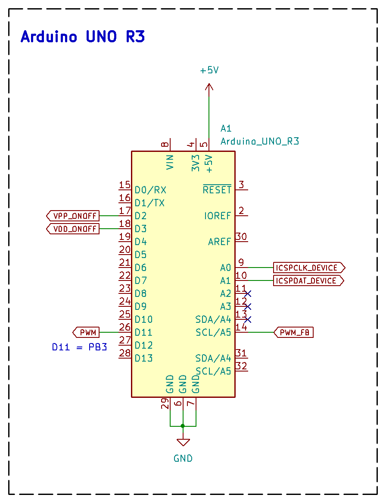
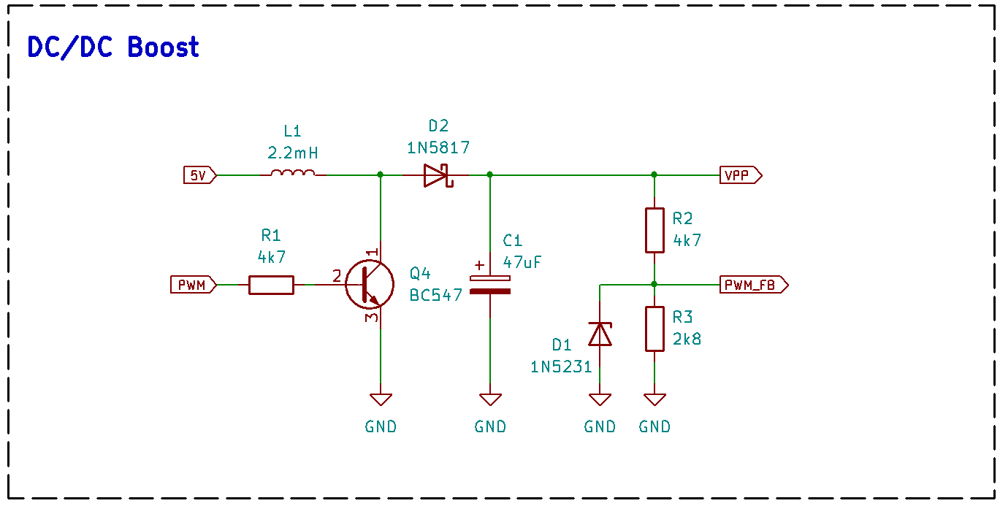
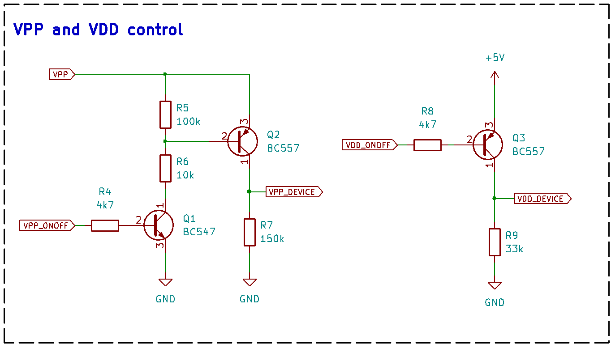

# PicArd Hardware

PicArd hardware is composed by:

1. Arduino Uno (in my project a clone R3 version);
2. DC-DC step-up (boost) converter and
3. Bipolar junction transistors to control PIC voltages.

As I don't intend to use this circuit frequently, I only assembled it on a breadboard.

## Arduino Uno

The following figure shows Arduino Uno R3 connections for this project.

Signals description:

+ VPP_ONOFF			- Turns on/off PIC's programming voltage (VPP)
+ VDD_ONOFF			- Turns on/off PIC's main voltage (VDD)
+ ICSPCLK_DEVICE		- Clock output to PIC
+ ICSPDAT_DEVICE		- Data input/output to/from PIC
+ PWM					- Controls VPP value 
+ PWM_FB				- PWM feedback voltage

## DC-DC Boost Converter

DC-DC Boost converter is responsible for raising the voltage from 5V 
to the programming voltage (VPP) required by PIC. 

I designed this circuit with scrap components and, in my tests, 
it worked very well with voltages between 6V and 13V.

PWM signal from Arduino controls Q4 through R1 and C2 (capacitor added to improve switching speed).
L1, D2 and C1 completes basic DC/DC boost circuitry. A voltage divider (R2 and R3) is
used to reduce VPP and avoid Arduino greater than 5V in PWM_FB pin. As an additional precaution, I added D1 (5.1V zener diode).

## Voltages Control

VPP (from DC/DC converter) and VDD (from Arduino) must be applied to PIC at specific times. 
Therefore, Arduino software needs to send VPP_ONOFF and VDD_ONOFF signals to control when the PIC will receive this voltages.
The circuit below shows my solution:

VPP_DEVICE and VDD_DEVICE must be applied to PIC's correspondent pins.

## PDF Schematic
[Full schematic PDF](https://github.com/NelsonBittencourt/Picard/blob/main/hardware/PicArd_Hardware_v039.pdf)

