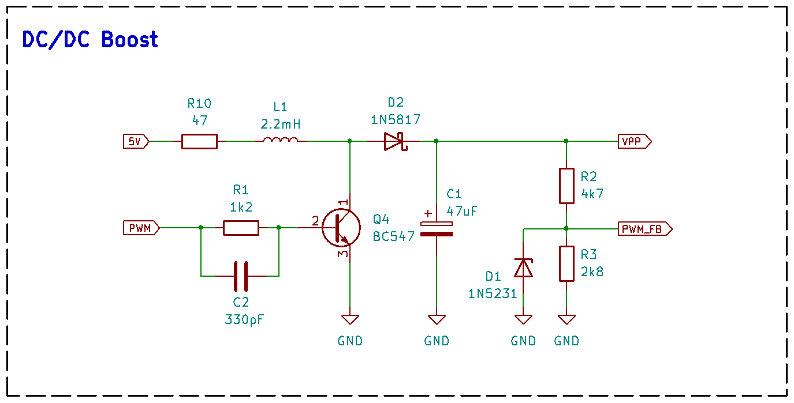

# PicArd Hardware
Pic programmer with Arduino Uno Hardware

# Arduino Uno
Text and image

# DC-DC Boost Converter
Text and image

# Voltages Control
Text and image

# PDF Schematic
[Full schematic PDF](https://github.com/NelsonBittencourt/Picard/blob/main/hardware/PicArd_Hardware_v039.pdf)

